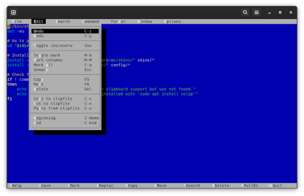

# mcdos

This project contains the config and skin for configuring [Midnight Commander] and especially mcedit to look more like the old [MS-DOS Editor] and behave more like modern GUI text editors like [Visual Studio Code].

Goals of this project are:

* Use keyboard hotkeys known from modern GUI text editors like Visual Studio Code.
* Configure text selection and copy/cut/paste to behave like a modern GUI text editor.
* Support copy/paste between X11/Wayland and mcedit.
* Work in GUI terminal like Gnome Terminal but also on TTY and over SSH.

## Installation

* Copy the content of `config/` to `$HOME/.config/`. This might override your current configuration, so make a backup if necessary.
* Create `~/.local/config/mc/skins/` if not already present.
* Copy the content of `skins/` to `~/local/config/mc/skins/`.

Alternatively run the `install.sh` script in this repository.

If you only wan't to use the configuration and keep the default skin of Midnight Commander then remove the `skin=mcdos256` line from `~/.config/mc/ini` or set it to whatever skin you want to use.

If you want clipboard support then you must install the `xclip` program. On Debian systems this program is provided by the `xclip` package which can be installed with `sudo apt install xclip`.

How you configure your system to use mcedit, is up to you. I would recommend setting an `EDITOR=mcedit` environment variable in `~/.profile` and maybe setting an alias like `alias edit=mcedit` in `~/.bashrc`.

## Skins

The following skin variations are provided:

Skin        | Description
------------|---------------------------------------------------------------------------------------------------------------------
mcdos256    | Uses fixed colors of the 256-color palette to be as close to the MS-DOS Editor colors as possible.
mcdos       | Uses the standard color names which are influenced by the terminal settings. Use this if 256-color palette does not work for you or you like the standard color palette of your terminal.

## Hotkeys

The hotkey listings here are not complete lists. They primarily document the hotkeys which are different to the default key mapping of mcedit.

### Button Bar

mcedit has a fixed button bar at the bottom which can't be configured and is not affected by the hotkey configuration. This configuration does not mess with function key mappings, so the button bar still makes sense and does not show wrong information. Currently this only has the downside that F3 can't be used for *Search Continue*.

### Editor hotkeys

Hotkey     | Command         | Function
-----------|-----------------|-------------------------
Tab        | BlockShiftRight | Indents marked lines
Shift+Tab  | BlockShiftLeft  | Unindents marked lines
Ctrl+D     | DeleteLine      | Delete current line
Ctrl+Left  | WordLeft        | Move cursor one word to the left
Ctrl+Right | WordTop         | Move cursor one word to the right

### File menu hotkeys

Hotkey     | Menu           | Command    | Notes
-----------|----------------|------------|------------------
Ctrl+E     | Open File      | EditFile   | Returning from the subshell is hardcoded to Ctrl-O, so we can't use Ctrl+O here and keep Ctrl-O has hotkey to enter the subshell. Using Ctrl-E because the command is named **EditFile** anyway.
Ctrl+N     | New File       | EditNew    |
Ctrl+W     | Close File     | Close      |
Ctrl+Alt+E | History        | History    | Opens/Edits a a *recent* file, so an alternate version of Ctrl-E
Ctrl+S     | Save File      | Save       |
Ctrl+Alt+S | Save File As   | SaveAs     | Ctrl-Shift-S is not mappable unfortunately
Ctrl+I     | Insert File    | InsertFile |
Ctrl+T     | Copy To File   | BlockSave  | T for copy "To" file
F12        | User Menu      | UserMenu   |
Ctrl+Q     | Quit           | Quit       |

### Edit menu hotkeys

Hotkey      | Menu                 | Command         | Notes
------------|----------------------|-----------------|------------------
Ctrl+Z      | Undo                 | Undo            |
Ctrl+Y      | Redo                 | Redo            |
Insert      | Toggle ins/overwrite | InsertOverwrite |
F3          | Toggle Mark          | Mark            | Fixed mapping in button bar
Alt+Shift+M | Mark Columns         | MarkColumn      |
Ctrl+a      | Mark All             | MarkAll         |
Escape      | Unmark               | Unmark          |
Delete      | Delete               | Delete          |
Ctrl+C      | Copy to clipfile     | Store           |
Ctrl+X      | Cut to clipfile      | Cut             |
Ctrl+V      | Paste from clipfile  | Paste           |
Ctrl+Home   | Beginning            | Top             |
Ctrl+End    | End                  | Bottom          |

### Search menu hotkeys

Hotkey      | Menu                 | Command        | Notes
------------|----------------------|----------------|------------------
Ctrl+F      | Search               | Search         |
Ctrl+Alt+F  | Search again         | SearchContinue | F3 has fixed meaning in button bar
Ctrl+R      | Replace              | Replace        | Ctrl+H is not mappable
Ctrl+Alt+K  | Toggle Bookmark      | Bookmark       |
Ctrl+Alt+L  | Next Bookmark        | BookmarkNext   |
Ctrl+Alt+J  | Prev Bookmark        | BookmarkPrev   |
Ctrl+Alt+I  | Flush Bookmark       | BookmarkFlush  |

### Command menu hotkeys

Hotkey      | Menu                       | Command              | Notes
------------|----------------------------|----------------------|------------------
Alt+G       | Go to line                 | Goto                 | Ctrl+G is not mappable
Alt+N       | Toggle line state          | ShowNumbers          |
Ctrl+\      | Go to matching bracket     | MatchBracket         | Ctrl+Shift+\ is not mappable
Alt+H       | Toggle syntax highlighting | SyntaxOnOff          |
Alt+Enter   | Find Declaration           | Find                 | Needs emacs style TAGS file to work
Alt+Minus   | Back from declaration      | FilePrev             | Needs emacs style TAGS file to work
Alt+Plus    | Forward to declaration     | FileNext             | Needs emacs style TAGS file to work
Alt+R       | Start/Stop record macro    | MacroStartStopRecord |

### Format menu hotkeys

Hotkey      | Menu                       | Command              | Notes
------------|----------------------------|----------------------|-----------------------------------------------------
Ctrl+U      | Insert Literal             | InsertLiteral        | Related to Ctrl-Shift-U which is handled by Terminal
Alt+P       | Format Paragraph           | ParagraphFormat      |
Alt+T       | Sort                       | Sort                 |
Alt+U       | Paste output of            | ExternalCommand      |

### Window menu hotkeys

Hotkey         | Menu                       | Command              | Notes
---------------|----------------------------|----------------------|-----------------------------------------------------------
Ctrl+Tab       | Next Window                | WindowNext           |
Ctrl+Shift+W   | Window List                | WindowList           |

[Midnight Commander]: https://midnight-commander.org/
[MS-DOS Editor]: https://en.wikipedia.org/wiki/MS-DOS_Editor
[Visual Studio Code]: https://code.visualstudio.com/
